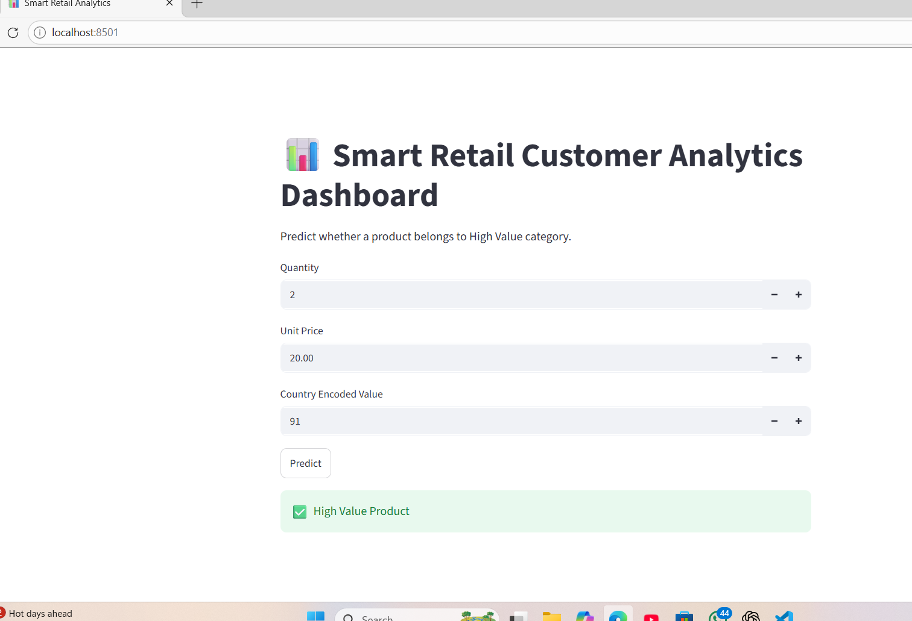

# 📊 Smart Retail Customer Analytics Dashboard

A Machine Learning project built using Python, Scikit-Learn, and Streamlit to analyze retail customer data and predict whether a product belongs to a High Value category.

## 🚀 Features

- Data Preprocessing
- Missing Value Handling
- Country Encoding
- Multiple ML Models
  - Logistic Regression
  - Decision Tree
  - K-Nearest Neighbors (KNN)
- Model Performance Comparison
- High Value Product Prediction
- Interactive Streamlit Dashboard


## 📌 Project Workflow

1. Load and preprocess retail dataset
2. Handle missing values
3. Encode categorical features
4. Train multiple Machine Learning models
5. Compare model performance
6. Save the best-performing model
7. Deploy prediction system using Streamlit


## 🛠️ Technologies Used

- Python
- Pandas
- NumPy
- Scikit-Learn
- Streamlit
- Matplotlib
- Joblib

## 📂 Project Structure

```text
smart-retail-analytics/
├── data/
│   └── OnlineRetail.csv
├── best_model.pkl
├── app.py
├── train.py
├── requirements.txt
├── README.md
└── .gitignore
```

## 📈 Machine Learning Models

| Model | Accuracy |
|---------|---------|
| Logistic Regression | 1.0000 |
| Decision Tree | 1.0000 |
| KNN | 0.9984 |

## ▶️ Installation

Clone the repository:

```bash
git clone https://github.com/shiv06082005/smart-retail-customer-analytics.git
```

Install dependencies:

```bash
pip install -r requirements.txt
```

Run model training:

```bash
python train.py
```

Run dashboard:

```bash
streamlit run app.py
```

## 📊 Dataset

The Online Retail dataset is included in this repository as a ZIP file.

Original Dataset Source:

[Online Retail Dataset](https://archive.ics.uci.edu/dataset/352/online+retail)


## 🖼️ Dashboard Preview



*Interactive Streamlit dashboard for High Value Product Prediction.*


## 🔮 Future Improvements

* Add Random Forest Classifier
* Add XGBoost Model
* Interactive data visualizations
* Country selection dropdown
* Streamlit Cloud deployment
* Real-time prediction analytics


## 🎯 Learning Outcomes

- Data preprocessing techniques
- Feature encoding
- Classification algorithms
- Model evaluation
- Streamlit dashboard development

## 👨‍💻 Author

Shivang Vijay
